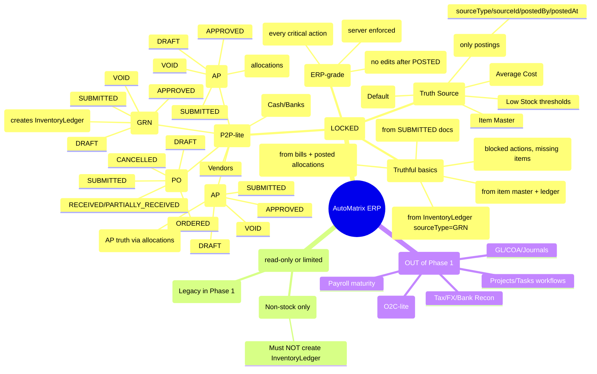

# ERP Diagrams (Phase 1 Blueprint)

These diagrams are a **living blueprint** of the current ERP spine.
Update this file whenever a workflow changes (schema/API/UI), so the CEO blueprint stays truthful.

## 1) Phase 1 Module Mindmap (Single-Spine)


## 2) Phase 1 Document Spine Flow (Truth Sources)
```mermaid
flowchart LR
  subgraph Procurement
    VND[Vendor]
    PO[Purchase Order]
    GRN[Goods Receipt (GRN)]
    BILL[Vendor Bill]
    PAY[Vendor Payment]
    CACCT[Company Account]
  end

  subgraph Inventory
    ITEM[Inventory Item Master]
    LEDGER[InventoryLedger (stock truth)]
  end

  subgraph AP
    APLEDGER[AP Truth (Bills - Posted Allocations)]
  end

  subgraph Controls
    RBAC[RBAC Server Checks]
    AUD[AuditLog]
  end

  VND --> PO --> GRN
  GRN -->|POST (explicit)| LEDGER
  ITEM <-->|qty/avg cost updates| LEDGER

  GRN --> BILL --> PAY --> CACCT
  BILL --> APLEDGER
  PAY -->|allocations| APLEDGER

  RBAC --- PO
  RBAC --- GRN
  RBAC --- BILL
  RBAC --- PAY

  AUD --- PO
  AUD --- GRN
  AUD --- BILL
  AUD --- PAY

  %% Guardrail (Phase 1): Expenses cannot do stock purchases.
  EXP[Expenses (Non-stock)] -. cannot post stock .-> LEDGER
```
