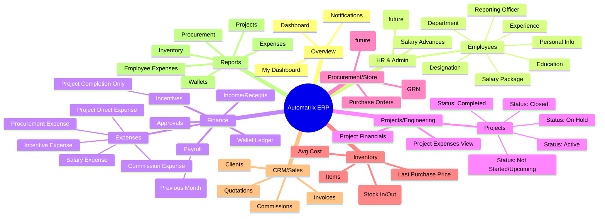
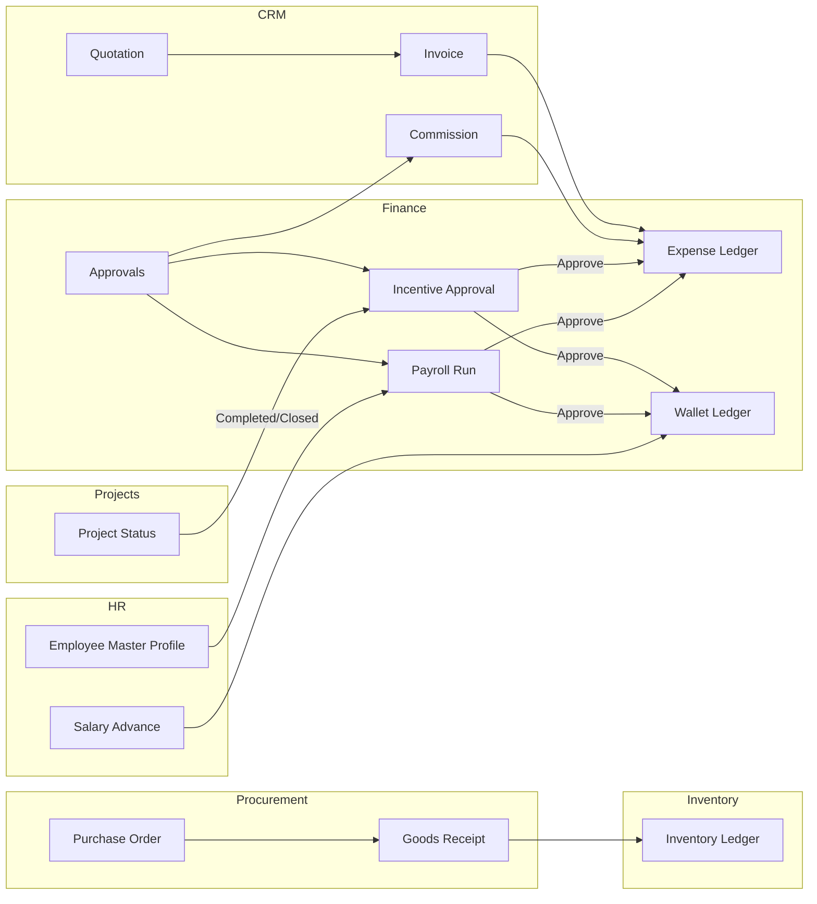

# ERP Diagrams (Draft)

These diagrams show the current module map and cross-module flows.
Names can be refined later without changing the structure.

## 1) Module Mindmap

## 2) Cross-Module Flow Diagram

